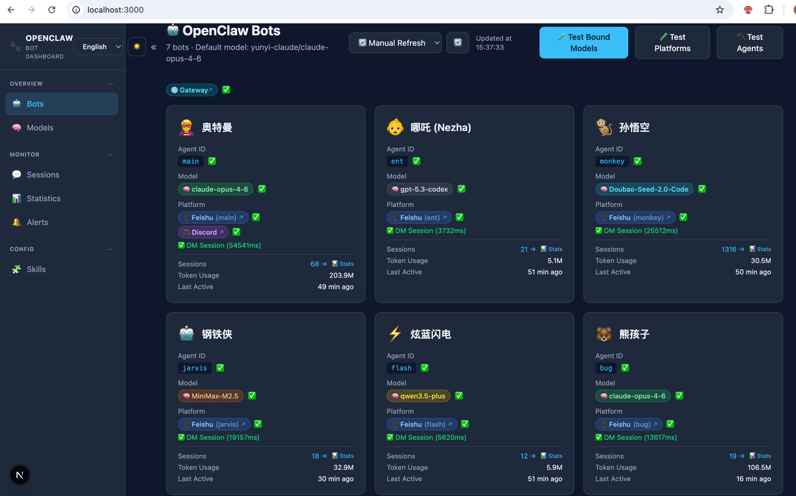

# OpenClaw Dashboard（English）

A lightweight web dashboard for viewing all your [OpenClaw](https://github.com/openclaw/openclaw) Bots/Agents/Models/Sessions status at a glance.
<br>Bots Dashboard：

Pixel Office：

## Background

When running multiple OpenClaw agents across different platforms (Feishu, Discord, etc.), managing and monitoring them becomes increasingly complex — which bot uses which model? Are the platforms connected? Is the gateway healthy? How are tokens being consumed?

This dashboard reads your local OpenClaw configuration and session data, providing a unified web UI to monitor and test all your agents, models, platforms, and sessions in real time. No database required — everything is derived directly from `~/.openclaw/openclaw.json` and local session files. Plus, a fun pixel-art office brings your agents to life as animated characters walking around, sitting at desks, and interacting with furniture.

## Features

- **Bot Overview** — Card wall showing all agents with name, emoji, model, platform bindings, session stats, and gateway health status
- **Model List** — View all configured providers and models with context window, max output, reasoning support, and per-model test
- **Session Management** — Browse all sessions per agent with type detection (DM, group, cron), token usage, and connectivity test
- **Statistics** — Token consumption and average response time trends with daily/weekly/monthly views and SVG charts
- **Skill Management** — View all installed skills (built-in, extension, custom) with search and filter
- **Alert Center** — Configure alert rules (model unavailable, bot no response) with Feishu notification delivery
- **Gateway Health** — Real-time gateway status indicator with 10s auto-polling and one-click jump to OpenClaw web UI
- **Platform Test** — One-click connectivity test for all Feishu/Discord bindings and DM sessions
- **Auto Refresh** — Configurable refresh interval (manual, 10s, 30s, 1min, 5min, 10min)
- **i18n** — Chinese and English UI language switching
- **Dark/Light Theme** — Theme switcher in sidebar
- **Pixel Office** — Animated pixel-art office where agents appear as characters that walk, sit, and interact with furniture in real time（The feature is inspired by Pixel Agents）
- **Live Config** — Reads directly from `~/.openclaw/openclaw.json` and local session files, no database needed

## Preview


## Getting Started

```bash
# Clone the repo
git clone https://github.com/xmanrui/OpenClaw-bot-review.git
cd OpenClaw-bot-review

# Install dependencies
npm install

# Start dev server
npm run dev
```

Open [http://localhost:3000](http://localhost:3000) in your browser.

## Tech Stack

- Next.js + TypeScript
- Tailwind CSS
- No database — reads config file directly

## Requirements

- Node.js 18+
- OpenClaw installed with config at `~/.openclaw/openclaw.json`

## Configuration

By default, the dashboard reads config from `~/.openclaw/openclaw.json`. To use a custom path, set the `OPENCLAW_HOME` environment variable:

```bash
OPENCLAW_HOME=/opt/openclaw 
npm run dev
```

## Docker Deployment

You can also deploy the dashboard using Docker:

### Build Docker Image

```bash
docker build -t openclaw-dashboard .
```

### Run Container

```bash
# Basic run
docker run -d -p 3000:3000 openclaw-dashboard

# With custom OpenClaw config path
docker run -d --name openclaw-dashboard -p 3000:3000 -e OPENCLAW_HOME=/opt/openclaw -v /path/to/openclaw:/opt/openclaw openclaw-dashboard
```

---

# OpenClaw Bot Dashboard（中文）

一个轻量级 Web 仪表盘，用于一览所有 [OpenClaw](https://github.com/openclaw/openclaw) 机器人/Agent/模型/会话的运行状态。

## 背景

当你在多个平台（飞书、Discord 等）上运行多个 OpenClaw Agent 时，管理和监控会变得越来越复杂——哪个机器人用了哪个模型？平台连通性如何？Gateway 是否正常？Token 消耗了多少？

本仪表盘读取本地 OpenClaw 配置和会话数据，提供统一的 Web 界面来实时监控和测试所有 Agent、模型、平台和会话。无需数据库——所有数据直接来源于 `~/.openclaw/openclaw.json` 和本地会话文件。此外，内置像素风动画办公室，让你的 Agent 化身像素角色在办公室里行走、就座、互动，为枯燥的运维增添一份趣味。

## 功能

- **机器人总览** — 卡片墙展示所有 Agent 的名称、Emoji、模型、平台绑定、会话统计和 Gateway 健康状态
- **模型列表** — 查看所有已配置的 Provider 和模型，包含上下文窗口、最大输出、推理支持及单模型测试
- **会话管理** — 按 Agent 浏览所有会话，支持类型识别（私聊、群聊、定时任务）、Token 用量和连通性测试
- **消息统计** — Token 消耗和平均响应时间趋势，支持按天/周/月查看，SVG 图表展示
- **技能管理** — 查看所有已安装技能（内置、扩展、自定义），支持搜索和筛选
- **告警中心** — 配置告警规则（模型不可用、机器人无响应），通过飞书发送通知
- **Gateway 健康检测** — 实时 Gateway 状态指示器，10 秒自动轮询，点击可跳转 OpenClaw Web 页面
- **平台连通测试** — 一键测试所有飞书/Discord 绑定和 DM Session 的连通性
- **自动刷新** — 可配置刷新间隔（手动、10秒、30秒、1分钟、5分钟、10分钟）
- **国际化** — 支持中英文界面切换
- **主题切换** — 侧边栏支持深色/浅色主题切换
- **像素办公室** — 像素风动画办公室，Agent 以像素角色呈现，实时行走、就座、与家具互动
- **实时配置** — 直接读取 `~/.openclaw/openclaw.json` 和本地会话文件，无需数据库

## 预览


## 快速开始

```bash
# 克隆仓库
git clone https://github.com/xmanrui/OpenClaw-bot-review.git
cd OpenClaw-bot-review

# 安装依赖
npm install

# 启动开发服务器
npm run dev
```

浏览器打开 [http://localhost:3000](http://localhost:3000) 即可。

## 技术栈

- Next.js + TypeScript
- Tailwind CSS
- 无数据库 — 直接读取配置文件

## 环境要求

- Node.js 18+
- 已安装 OpenClaw，配置文件位于 `~/.openclaw/openclaw.json`

## 自定义配置路径

默认读取 `~/.openclaw/openclaw.json`，可通过环境变量指定自定义路径：

```bash
OPENCLAW_HOME=/opt/openclaw 
npm run dev
```
